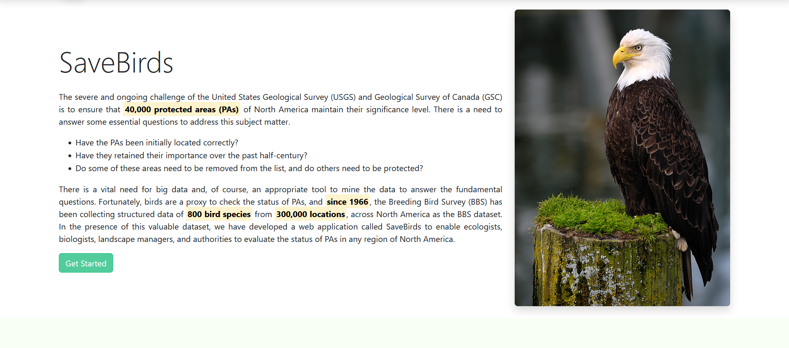
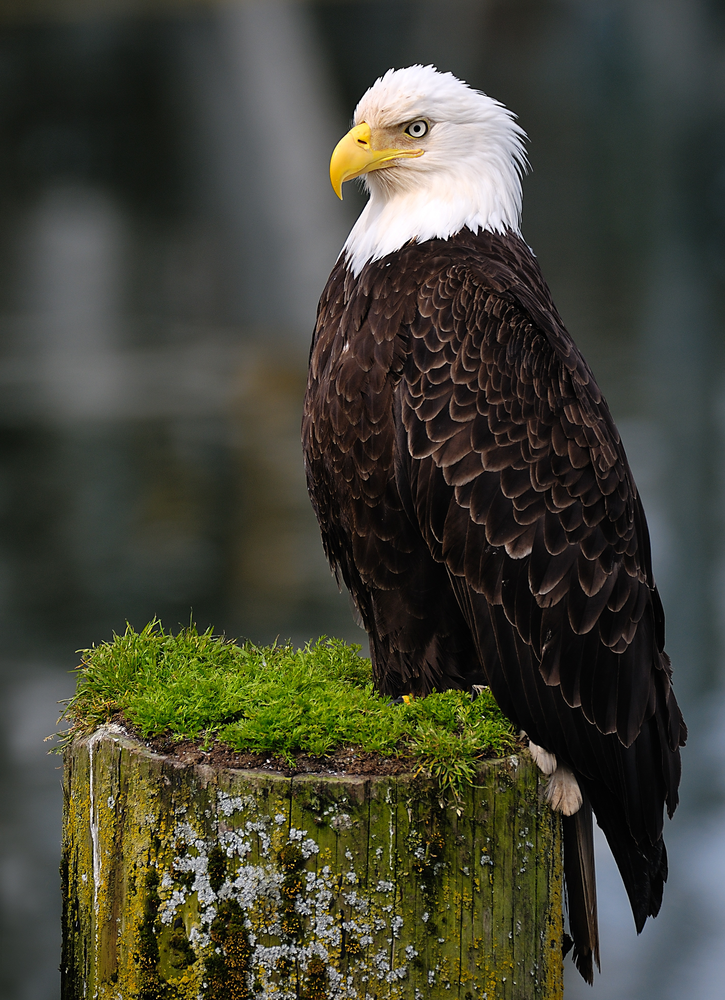

<h1 align="center">SaveBirds.app Home Page</h1>

# 1. Overview
Create the main landing page (Home) for SaveBirds.app using Vue 3 and Bootstrap 5. This page should provide a welcoming introduction to the application and invite users to explore its features.

# 2. Design Requirements

## 2.1. Layout Structure
The home page should consist of two main sections:
- **Explanation Section**: Title, descriptive text, and call-to-action button
- **Bird Image Section**: Large, high-quality image of a Bald Eagle

## 2.2. Visual Reference

- Source: `images/eagle.jpg`

# 3. Component Specifications

## 3.1. Explanation Section
- **Title**:
  - Text: "SaveBirds"
  - Font: Large, bold, prominent
  - Position: Top of the content area, centered or left-aligned

- **Descriptive Text**:
  - Content: Provide a clear, concise description of the SaveBirds application and its purpose
  - Length: 2-3 paragraphs that explain:
    - What SaveBirds is (a tool for analyzing North American Breeding Bird Survey data)
    - How it helps with bird conservation efforts
    - The types of analysis users can perform
  - Font: Clean, readable font consistent with the rest of the site
  - Position: Below the title

- **Call-to-Action Button**:
  - Text: "Get Started"
  - Color: Green (#28a745 or Bootstrap's .btn-success)
  - Size: Prominent, easily clickable
  - Hover effect: Slightly darker shade of green
  - Action: When clicked, navigate to the Metrics page
  - Position: Below the descriptive text
  - Visual: Rounded corners, appropriate padding

## 3.2. Bird Image Section
- **Image**:
  - Content: Bald Eagle standing on wood
  
  - Source: `images/eagle.jpg`
  - Alt text: "Bald Eagle standing on wood"
  - Style:
    - Rounded corners
    - Subtle shadow effect
    - Responsive (full width of container)
    - High quality but optimized for web
  - Position: Prominent on the page, either beside or below the explanation section depending on screen size

# 4. Responsive Behavior
- **Desktop View**:
  - Two-column layout with explanation on the left and image on the right
  - Balanced spacing between elements
  - Full-width image within its container

- **Mobile View**:
  - Single-column layout with explanation above the image
  - Text and button centered
  - Image scaled appropriately to fit screen width

# 5. Implementation Notes
- Create as a Vue component in `views/HomeView.vue`
- Use Bootstrap 5 grid system for responsive layout
- Implement with Bootstrap classes for styling
- Ensure the image is properly optimized for web performance (compressed without significant quality loss)
- Include appropriate animations or transitions for a polished user experience
- Ensure all text is readable on various screen sizes and follows accessibility guidelines

# 6. Code Structure
- Use semantic HTML5 elements (`<main>`, `<section>`, etc.)
- Implement as a single-file component with template, script, and style sections
- Style using Bootstrap classes with minimal custom CSS
- For any custom styles, use scoped CSS to avoid conflicts
